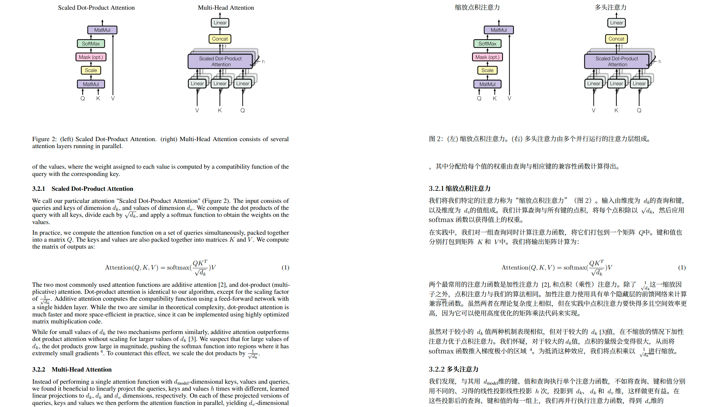

# arxiv-translate-skill

[English](README.md) | [简体中文](README.zh-CN.md)

Translate arXiv papers and academic PDFs into Simplified Chinese and produce a
layout-preserving side-by-side bilingual PDF. The left side keeps the original
English PDF layout; the right side contains the Chinese translation rendered by
BabelDOC.

This is a project-coupled Agent Skill. The installer targets Codex and Claude
Code; the skill files are installed into the selected client directory, while
the Python/BabelDOC runtime environment is provided by this repository.

## Preview

<p align="center">
  
</p>

<p align="center">
  <em>Example output: layout-preserving side-by-side bilingual PDF with source text on the left and Simplified Chinese translation on the right.</em>
</p>

## Requirements

- Python 3.12.
- `uv` on `PATH`.
- Network access during setup and when downloading arXiv papers.
- An agent client that can read Agent Skills and run local shell commands.
- Local subagent/parallel-agent support for faster batch translation.

## Quick Install

Run one mode from the repository root. `--agent` selects the client, and
`--scope` selects where the skill is installed:

```bash
python3 scripts/install_skill.py --agent codex --scope project --bootstrap --force
```

Install modes:

| Client | Scope | Command | Destination |
| --- | --- | --- | --- |
| Codex | Current repository | `python3 scripts/install_skill.py --agent codex --scope project --bootstrap --force` | `.agents/skills/arxiv-bilingual-pdf-translate` |
| Codex | Current user | `python3 scripts/install_skill.py --agent codex --scope user --bootstrap --force` | `$CODEX_HOME/skills/...`, defaulting to `~/.codex/skills/...` |
| Claude Code | Current repository | `python3 scripts/install_skill.py --agent claude --scope project --bootstrap --force` | `.claude/skills/arxiv-bilingual-pdf-translate` |
| Claude Code | Current user | `python3 scripts/install_skill.py --agent claude --scope user --bootstrap --force` | `~/.claude/skills/arxiv-bilingual-pdf-translate` |

Print all modes and resolved paths:

```bash
python3 scripts/install_skill.py --list-modes
```

`--bootstrap` creates or updates `.venv`, installs dependencies, prepares
runtime directories, and warms BabelDOC assets. The installer then runs
preflight to check Python/BabelDOC, the glossary, and writable output
directories.

If the environment is already initialized, omit `--bootstrap`:

```bash
python3 scripts/install_skill.py --agent claude --scope project --force
```

The installer writes `.install-manifest.json` into the installed skill copy with
this repository's `project_root`. That lets user-scope installs still find the
project-local `.venv`, `glossary/`, and output directories.

## Advanced Install

Initialize the runtime separately:

```bash
python3 skills/arxiv-bilingual-pdf-translate/scripts/bootstrap.py
.venv/bin/python skills/arxiv-bilingual-pdf-translate/scripts/arxiv_translate.py preflight
```

Use legacy explicit targets:

```bash
python3 scripts/install_skill.py --target codex-project --force
python3 scripts/install_skill.py --target codex-user --force
python3 scripts/install_skill.py --target claude-project --force
python3 scripts/install_skill.py --target claude-user --force
```

Install into a custom skill directory:

```bash
python3 scripts/install_skill.py --dest /path/to/skills/arxiv-bilingual-pdf-translate --force
```

For legacy Codex runtimes that read `CODEX_HOME`, use:

```bash
python3 scripts/install_skill.py --target codex-home --force
```

## Use

After installation, start your agent from this repository root. Codex users
should start a new Codex session. Claude Code users should restart `claude` if
`.claude/skills` was created for the first time while Claude Code was already
running.

Ask your agent:

```text
Use arxiv-bilingual-pdf-translate to translate arXiv 1812.10695 into a side-by-side Simplified Chinese bilingual PDF.
```

In Claude Code, you can also invoke the slash command directly:

```text
/arxiv-bilingual-pdf-translate 1812.10695
```

Other supported inputs:

```text
Use arxiv-bilingual-pdf-translate to translate https://arxiv.org/abs/1812.10695 into a side-by-side Simplified Chinese bilingual PDF.
```

```text
Use arxiv-bilingual-pdf-translate to translate ./paper.pdf into a side-by-side Simplified Chinese bilingual PDF.
```

The final PDF is written to:

```text
arxiv_outputs/<paper>.zh-CN.dual.pdf
```

Intermediate files are kept under `.arxiv_work/` and are normally only useful
for debugging failed runs.

## Glossary

Edit project terminology here:

```text
glossary/terms.csv
```

The CSV columns are:

```text
source,target,case_sensitive
```

You can also append a term with:

```bash
.venv/bin/python skills/arxiv-bilingual-pdf-translate/scripts/glossary.py add "attention mechanism" "注意力机制"
```

Validate the active glossary:

```bash
.venv/bin/python skills/arxiv-bilingual-pdf-translate/scripts/glossary.py validate
```

## Troubleshooting

If you are not sure where a mode installs:

```bash
python3 scripts/install_skill.py --list-modes
```

If Claude Code cannot see the skill, confirm it was installed under
`.claude/skills/...` or `~/.claude/skills/...`, not only under
`.agents/skills/...`. Restart `claude` if the top-level skills directory was
created after the session started.

If Codex cannot see the user-scope skill, confirm it was installed under
`$CODEX_HOME/skills/...`, defaulting to `~/.codex/skills/...`, then start a new
Codex session.

If the agent cannot run the skill, run:

```bash
.venv/bin/python skills/arxiv-bilingual-pdf-translate/scripts/arxiv_translate.py preflight
```

If BabelDOC import or asset loading fails, rerun setup:

```bash
python3 skills/arxiv-bilingual-pdf-translate/scripts/bootstrap.py
```

If rendering fails for a specific PDF, ask the agent to retry with enhanced
compatibility or rich-text translation disabled. The skill contains the retry
rules for those cases.

## License And Attribution

This project is released under the GNU General Public License v3.0. See
[LICENSE](LICENSE).

Open-source attribution:

- BabelDOC: PDF parsing, layout preservation, and rendering. Repository:
  <https://github.com/funstory-ai/BabelDOC>.
- GPT Academic: workflow inspiration. Repository:
  <https://github.com/binary-husky/gpt_academic>.
- kaixindelele/chinarxiv: original project inspiration. Repository:
  <https://github.com/kaixindelele/chinarxiv>.

See [NOTICE](NOTICE) for details.
